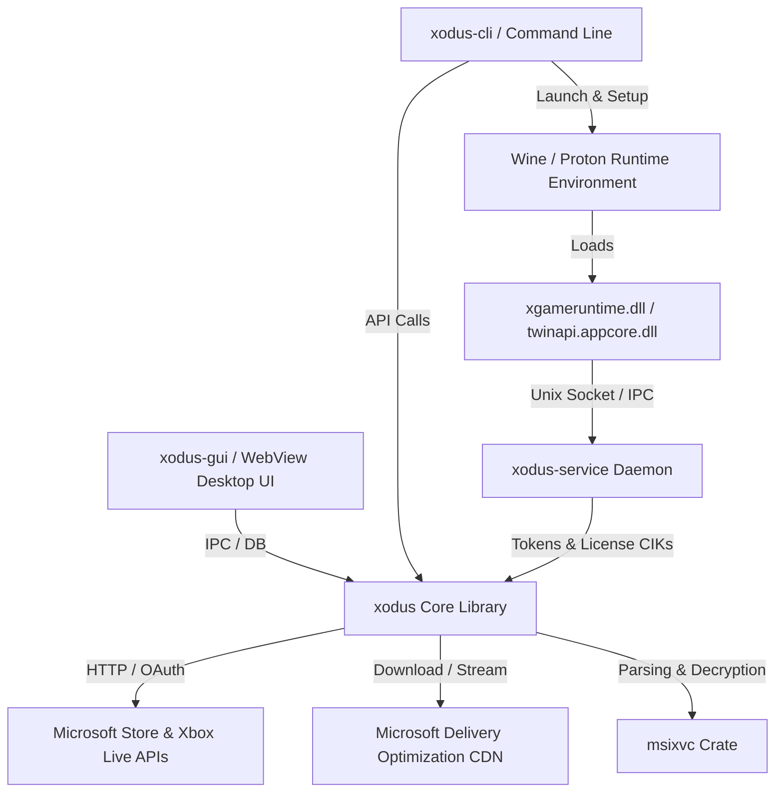

# Xodus System Architecture

## 1. Overview & Design Principles

Xodus is built around a modular, security-conscious architecture that enables seamless management and native execution of Microsoft Store and Xbox Game Pass titles on Linux.

### Key Goals:
1. **Zero-Duplication Decryption**: Store games keep their original disk structure and container files. Executables and payload segments are decrypted on-the-fly and linked into runtime execution environments without requiring full duplication of multi-gigabyte installations.
2. **Unified Authentication State**: The user authenticates once via Microsoft OAuth2 device flow. Tokens and device credentials are securely managed and shared with `xodus-service` and Wine GDK runtimes.
3. **Seamless Proton & Wine Integration**: Automated compatibility prefix generation, dynamic `dosdevices` virtual drive letter mapping (`X:`), Easy Anti-Cheat (EAC) native runtime discovery, and runtime DLL injection.
4. **Cloud Save Continuity**: Transparent bidirectional Xbox Live Connected Storage synchronization before game launch (`pull`) and upon process termination (`push`).

---

## 2. Component Layout

### 2.1 Crate Breakdown

- **`msixvc`**: Low-level Rust parser for Microsoft Xbox Virtual Disk (`.xvd` / `.msixvc`) and Xbox Streaming Package (`.xsp`) formats. Implements AES-XTS/AES-CBC hardware-accelerated decryption routines with SSSE3/AES-NI support.
- **`xodus`**: Core domain logic, including:
  - Device authentication (`DeviceAuthClient`, CLEP challenge handling).
  - Xbox Live token acquisition (XASU, XSTS, User Tokens).
  - Microsoft Store Catalog queries, BigID mapping, and entitlements.
  - Connected Storage / Title Storage cloud save synchronization.
  - SQLite metadata cache and secure credential storage.
- **`xodus-cli`**: High-performance command-line binary implementing `login`, `status`, `streaming`, `run`, `save`, `license`, and container management.
- **`xodus-gui`**: Hardware-accelerated desktop application using Wry/Tao, featuring a reactive web interface, cover art hydration, MangoHud/FSR launch options, and download management.
- **`xodus-service`**: System daemon exposing a Unix domain socket (`/tmp/xodus.sock` or `$XDG_RUNTIME_DIR/xodus.sock`) for IPC with GDK Winelib components running inside Wine.

---

## 3. Package Streaming & Execution Lifecycle

1. **Entitlement Verification**: Queries user entitlement tokens for the specified Title ID or Store BigID.
2. **Content Key Acquisition**: Resolves Content Encryption Keys (CIK) from Microsoft Licensing Services.
3. **Streaming Download**: Downloads package header blocks and chunk metadata from CDN. As chunks arrive, they are validated against package hashes and decrypted in memory.
4. **Execution Preparation**:
   - Creates an isolated runtime cache folder (`~/.cache/xodus/run/<title-id>`).
   - Decrypts the target executable into `~/.cache/xodus/bin/<title-id>/` and zero-copy symlinks all assets, configs, and subdirectories.
   - Maps `X:` drive in the Proton prefix `dosdevices` directory to prevent EAC Z-drive rejection.
   - Injects Wine PE stub DLLs (`xgameruntime.dll`, `twinapi.appcore.dll`, `api-ms-win-core-psm-appnotify-l1-1-0.dll`) and forwards GDK API calls to the Linux Winelib implementation.
5. **Cloud Save Pull**: Pulls remote save blobs from Xbox Live Title Storage.
6. **Session Monitoring & Push**: Monitors game process execution. When the game exits, modified save files are automatically committed and uploaded to Xbox Live cloud storage.